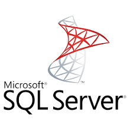
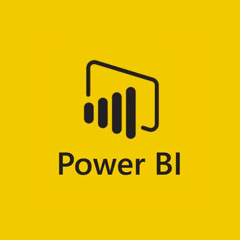
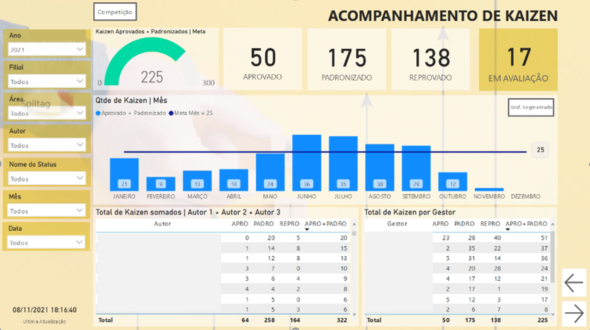
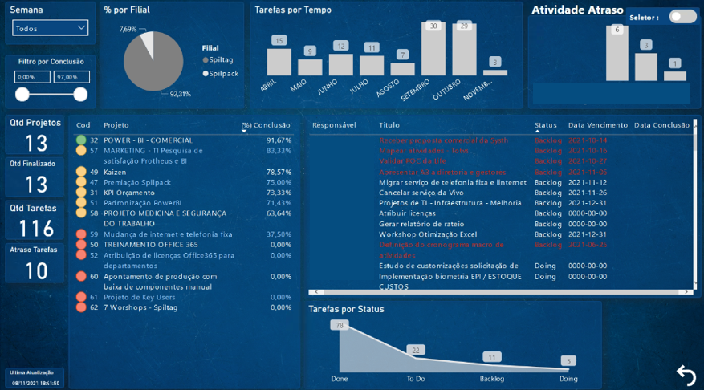
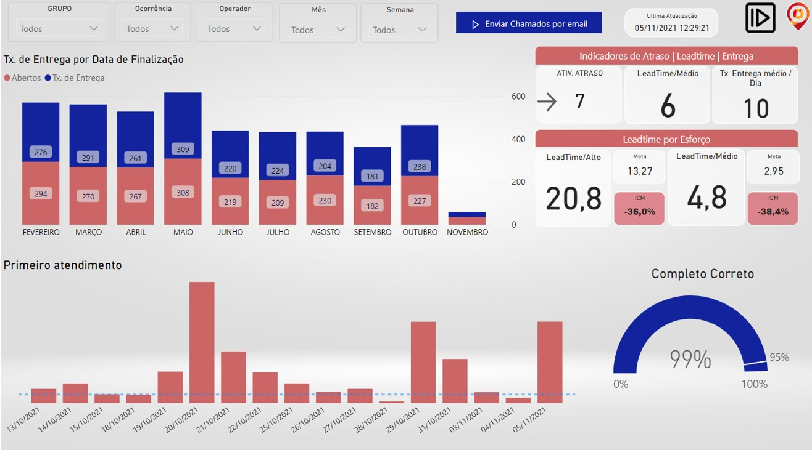
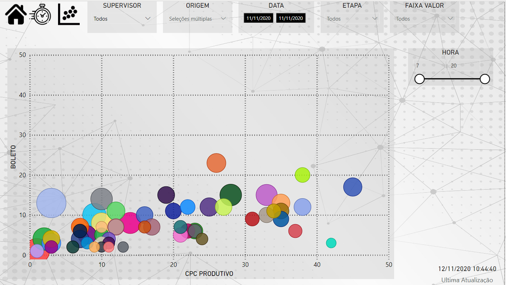

### Bem-vindo! Olá, tudo bem? Espero que sim. 

Meu intuito nesta pagina é demonstrar o meu trabalho, aquilo que faço e quais ferramentas utilizo em meu dia a dia. 

# Quem é Ronaldo?

Bom, meu nome você já sabe, tenho 33 anos, sou casado a 8 anos com a Danielí, esposa maravilhosa e temos 2 lindos filhos, a Rebeca de 4 anos e o Davi de 1. 
Estou me formando em 2 faculdades, sendo elas, teologia(2023) e processos gerenciais(2021), fora cursos em que tenho feito para aprimorar o conhecimento, estatística para data science, python analytics, Powerbi, Rshiny(criação de dashboards), entre outros. 

# Ferramentas.

 
 
 
 
 

### Atualmente

Atuo em uma indústria em ritmo de crescimento, jovial e dinâmica, meu desafio aqui é colaborar para uma transformação digital, dentre os desafios, destaco a mudança na forma de criar dashboards, o que antes era oriundo de planilhas de excel(nada contra), para o consumo direto banco de dados. O primeiro ponto aqui é fazer com que todos pensem da mesma forma. Pois o preparo para o consumo direto no banco de dados é maior, então o foco é fazer uma unica vez, e de forma correta.
O que tem sido a menina dos olhos. É um projeto de data mining, estudamos o mercado, comparando ao que existe com o temos, nosso foco é crescer em marketshare. Logo mais coloco informações dele aqui. 

### Segue alguns dashboard desenvolvidos
<dl>
 <dt>Dashboard 1</dt>

  

 
 <dt>Dashboard 2</dt>

 

  
 

 
 <dt>Dashboard 3</dt>

 

  
 

  <dt>Dashboard 4</dt>

 

  
 

 
 <dt>Dashboard 5</dt>

 

  
 

 
 <dt>Dashboard 6</dt>

 

  
 

 
</dl>

## Redes Sociais

<a href="https://github.com/ronaldobribeiro/">GitHub</a>

<a href="https://www.instagram.com/ronaldogribeiro/">Instagram</a>

